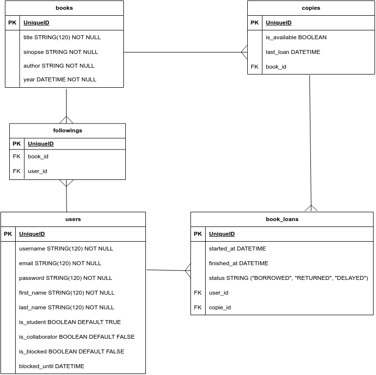

# BiblioteKA

## 1 - Sobre

Projeto realizado em grupo com o intuito de simular uma biblioteca. 

--- 

## 2 - Tecnologias

Um pouco das tecnologias que foram utilizadas no projeto: 

- [Python](https://www.python.org)
- [Django](https://www.djangoproject.com)
- [django rest framework](https://www.django-rest-framework.org)
- [PostgreSQL](https://www.postgresql.org/)

---

## 3 - Diagrama 

Diagrama da API definindo as relações entre as tabelas do banco de dados.



---

## 4 - Instalação e uso

### Requisitos:
- [Python](https://www.python.org)
- [pip](https://pypi.org/project/pip/)
- [PostgreSQL](https://www.postgresql.org)

Clone o projeto em sua máquina e crie um ambiente virtual (venv) com o comando:

```shell
python -m venv venv
```

Em seguida, ative o venv:

```shell
(WINDOWS)        source venv/Scripts/Activate
(Linux ou macOS) source venv/bin/activate
```

Em seguida, crie um arquivo **.env**, copiando o formato do arquivo **.env.example**:

```
env.example -> .env
```
Configure as variáveis de ambiente com suas credenciais do Postgres e uma nova database da sua escolha.

Execute as migrations com o comando:

```
python manage.py migrate
```

Para rodar o servidor localmente: 

```
python manage.py runserver
```

#### As requisições podem ser testadas em programas como o [Insomnia](https://insomnia.rest/download), [Postman](https://www.postman.com), etc!

---

### Você pode encontrar a documentação com esse EndPoint em seu Browser: 
## /api/docs/swagger/
